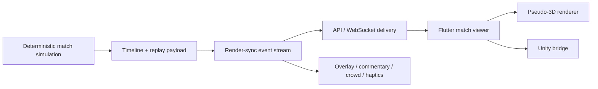
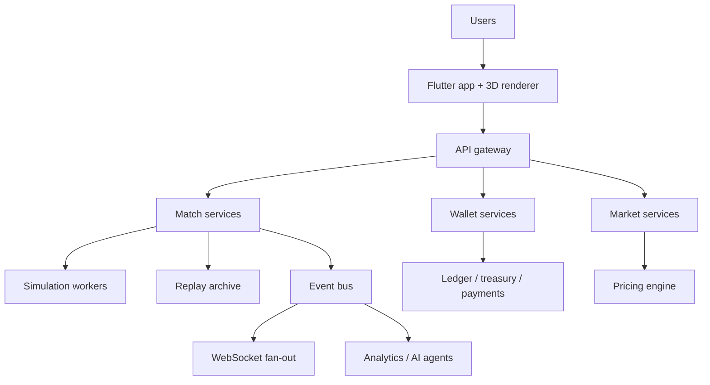

# 3D Match Engine System Design

## Scope

This document defines the canonical GTEX "FIFA-like" match-engine architecture for deterministic football simulation, event streaming, and 3D client rendering.

The design is intentionally split into two layers:

- server-authoritative football logic
- client-authoritative visual interpolation and presentation

That separation keeps outcomes fair and reproducible while still allowing cinematic rendering on Flutter, Flame, or Unity.

## Core pipeline



Current repo seams already align to this split:

- backend simulation: `backend/app/match_engine/simulation/`
- commentary timeline: `backend/app/match_engine/commentary/timeline.py`
- replay, highlight, sync, and immersion layers: `backend/app/match_engine/services/`
- public contracts and endpoints: `backend/app/match_engine/schemas.py`, `backend/app/match_engine/api/router.py`
- Flutter scene graph and bridge: `frontend/lib/models/match_3d_scene_graph.dart`, `frontend/lib/services/match_3d_scene_manager.dart`, `frontend/lib/services/match_3d_bridge.dart`
- Unity runtime consumer: `unity/Assets/GtexMatch3D/Runtime/Scripts/`

## Simulation model

The backend should not run a full physics engine. It should run a deterministic football model that emits authoritative outcomes and spatial hints.

Canonical loop:

```python
for possession in match_window:
    state = update_match_state()
    event = maybe_generate_event(state)

    if event:
        emit_timeline_event(event)
        emit_render_sync_event(event)
```

Recommended interpretation:

- server time model: possession/minute driven
- client time model: frame/tick driven
- server output: goals, fouls, saves, cards, substitutions, tactical swings, spatial origin/target hints
- client output: interpolation, animation blending, ball travel, camera motion, overlays, sound

The existing repo already follows this pattern:

- `MatchEventGenerator` decides the football outcome
- `MatchCommentaryTimelineGenerator` turns outcomes into presentation events
- `MatchRenderSyncBuilder` turns those events into client render-sync payloads

## State machines

### Match phase state machine

Primary states:

- `scheduled`
- `walkout`
- `kickoff`
- `live`
- `halftime`
- `resumed`
- `fulltime`
- `replay`

The current public APIs already expose `scheduled`, `live`, `fulltime`, and `paused` semantics through `MatchStatus` plus live-feed/replay endpoints.

### Player animation state machine

Canonical player states:

- `idle`
- `run`
- `sprint`
- `receive`
- `pass`
- `shoot`
- `tackle`
- `celebrate`
- `intercept`
- `recover`

These already exist in the Flutter 3D scene graph as `Match3dAnimationState` and in the Unity runtime animation bindings.

Typical transitions:

```python
if has_ball and near_goal:
    state = "shoot"
elif defending and tackle_window_open:
    state = "tackle"
elif transition_speed > sprint_threshold:
    state = "sprint"
else:
    state = "run"
```

### Ball state model

Canonical ball states:

- `carry`
- `pass`
- `shot`
- `loose`
- `reset`

The backend should emit intent plus origin/target/speed. The client handles simplified motion:

```python
ball.position += velocity
velocity *= friction
```

That is the right abstraction boundary for GTEX. We want believable motion, not client-side authority over match outcomes.

## Event contract

There are two payload layers.

### 1. Backend render-sync contract

The backend emits deterministic event packets via `MatchRenderSyncPayloadView` and `MatchRenderSyncEventView`.

Representative event shape:

```json
{
  "match_id": "fixture_001",
  "event_id": "evt_goal_72",
  "tick": 1440,
  "minute": 72,
  "presentation_second": 61,
  "event_type": "GOAL",
  "team": "home",
  "team_id": "club_home",
  "player_id": "player_9",
  "secondary_player_id": "player_10",
  "position": { "x": 84.0, "y": 48.0 },
  "target_position": { "x": 96.0, "y": 50.0 },
  "meta": {
    "camera_mode": "cinematic",
    "ball_motion": "shot",
    "ball_speed": 31.4,
    "replay_eligible": true,
    "commentary": "He buries it in the corner."
  },
  "experience": {
    "commentary": {},
    "crowd": {},
    "motion": {},
    "spectator_sync": {}
  }
}
```

### 2. Client scene-sync contract

Flutter converts the active frame into a `SCENE_SYNC` payload for pseudo-3D paint or Unity handoff.

Representative shape:

```json
{
  "type": "SCENE_SYNC",
  "matchId": "fixture_001",
  "frameId": "frame_1440",
  "clockMinute": 72.3,
  "phase": "live",
  "camera": {},
  "action": {},
  "experience": {},
  "entities": [],
  "matchEvent": {}
}
```

This is the right place to encode:

- player positions and velocities
- current animation state and target blend
- active camera rig
- crowd/commentary/haptics intensity
- the currently highlighted football event

## Camera system

Canonical user-facing modes:

- broadcast view
- player focus
- goal replay zoom

Current runtime mapping:

- broadcast view -> follow-ball camera with `broadcast` preset
- player focus -> tactical/follow-ball mix focused on primary actor
- goal replay zoom -> cinematic mode with `goalbox` preset

Camera control should stay event-driven:

- default play: broadcast
- attacking phase: player focus or attack zoom
- shot/save/goal: cinematic
- foul/offside/review: tactical freeze or tactical pan

## Event-to-animation mapping

The animation layer should remain data-driven.

```json
{
  "GOAL": "celebrate",
  "SAVE": "receive",
  "MISS": "shoot",
  "FOUL": "tackle",
  "OFFSIDE": "recover",
  "PASS": "pass",
  "SHOT": "shoot"
}
```

GTEX already uses this pattern in `Match3dSceneManager` when converting active match events into `Match3dSceneAction` and target animation blends.

## Client rendering pipeline

Canonical client pipeline:

1. Fetch replay, timeline, render-sync, or live-feed data from the match-engine API.
2. Build `MatchViewState` from authoritative backend data or deterministic fallback fixtures.
3. Convert the active timeline frame into a `Match3dSceneGraph`.
4. Render with one of these backends:
   - Flutter pseudo-3D canvas
   - Flame scene consumer
   - Unity embedded runtime
5. Feed the same active event into:
   - HUD overlays
   - commentary text / TTS
   - crowd audio intensity
   - haptic feedback

Important rule:

- one authoritative event stream
- many renderers

Do not create separate football logic for Flutter and Unity.

## Immersion layer

Immersion should be attached to the same event stream, not computed in isolation.

Required layers:

- crowd noise rises with pressure, chances, goals, and rivalry spikes
- commentary cue contains tone, intensity, and TTS readiness
- mobile haptics react to goals, saves, fouls, and reviews
- replay and watch-party sync stay bound to the deterministic shared clock

The backend already models this through `MatchExperienceLayerView`:

- `motion`
- `commentary`
- `crowd`
- `spectator_sync`

## APIs

Current match-engine routes already cover the needed system seams:

- `POST /api/match-engine/replay`
- `POST /api/match-engine/timeline`
- `POST /api/match-engine/summary`
- `POST /api/match-engine/render-sync`
- `POST /api/match-engine/analytics`
- `GET /api/match-engine/live-feed/{match_key}`
- `GET /api/match-engine/highlights/{match_key}`
- `GET /api/match-engine/render-sync/{match_key}`

Recommended delivery model:

- replay and post-match: REST
- live match deltas: WebSocket or SSE
- notifications and fan reactions: event bus fan-out

## Production topology



For matches specifically:

- simulation workers produce deterministic outcomes
- replay/archive stores match payloads and derived highlight packages
- event bus distributes live deltas, commentary, and reactions
- websocket gateways keep spectators synchronized
- analytics consumes the same event stream for insights and monetization triggers

## Implemented now vs next

Implemented in this repo:

- deterministic backend match simulation
- replay timeline and summary generation
- render-sync event contract
- Flutter pseudo-3D scene graph
- Unity runtime consumer for `SCENE_SYNC`
- commentary, crowd, and spectator-sync experience layers

Recommended next work:

- live WebSocket transport for render-sync deltas instead of replay-only polling
- Flame adapter that consumes the same scene-sync contract as Unity
- richer replay camera rails and authored goal replays
- explicit haptics/audio mixer hooks on mobile
- deeper ball flight modeling while keeping outcome authority on the server

## Architectural rules

- Server decides football truth.
- Client decides visual interpolation.
- One event contract feeds all renderers.
- Replay and live match delivery share the same schema family.
- Wallet, market, and match systems integrate at the API and event-bus layers, not inside the renderer.
