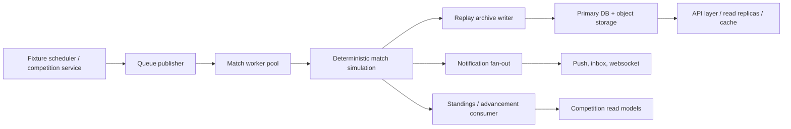

# Match Lifecycle + 100k Concurrent Architecture

## Scope

This document covers the canonical fixture lifecycle used by the local MVP backend and the production topology required to scale the same flow to 100,000 concurrent users.

Canonical lifecycle:

1. Fixture scheduled
2. Dispatch job created
3. Worker execution claimed
4. Deterministic match simulation completed
5. Result generated
6. Commentary and key moments produced
7. Replay archive updated
8. Notifications emitted
9. Standings or advancement updated

## Implemented Today

- API layer: FastAPI application with replay and notification routes already mounted by the shared app.
- Queue / broker: in-process `InMemoryQueuePublisher` publishes idempotent queue records and queue events.
- Worker pool: local `LocalMatchExecutionWorker` subscribes to queue events and executes the full lifecycle synchronously for local development.
- Simulation: `MatchSimulationService` and `MatchEventGenerator` produce deterministic match results, commentary, and replay timelines from a seed.
- Replay archive: `ReplayArchiveService` persists replay summaries and countdown metadata into the configured repository.
- Notifications: `NotificationCenter` translates lifecycle events into user-visible inbox notifications.
- Competition update seam:
  - league fixtures apply results directly through `LeagueSeasonLifecycleService`
  - cup fixtures emit `competition.match.advancement.requested` for downstream knockout consumers

## 100k Target Topology

### API layer

- Stateless FastAPI pods behind an L7 load balancer.
- Separate read and write API paths where possible:
  - write path for scheduling, auth, and user actions
  - read path for replay, standings, and notification feeds
- JWT auth verification should stay fully stateless at the edge.

### Queue / broker

- Replace the in-memory queue with a durable broker such as Kafka, Redpanda, SQS + SNS, or RabbitMQ.
- Use separate topics or queues for:
  - `match_simulation`
  - `bracket_advancement`
  - `notification`
  - `payout_settlement`
- Preserve the current idempotency keys as broker message keys or de-duplication ids.

### Worker pool

- Split workers by workload shape:
  - simulation workers for CPU-heavy deterministic match execution
  - notification workers for fan-out
  - replay projection workers for archive writes and object uploads
  - competition state workers for standings / advancement projections
- Workers must be horizontally autoscaled from queue lag and CPU saturation, not from HTTP traffic.

### Cache layer

- Redis for:
  - hot countdown views
  - replay summary lists
  - notification feed caching
  - websocket session fan-out
- Cache only derived views. Match results and replay records remain source-of-truth in durable storage.

### Primary DB

- Primary relational database stores:
  - replay archive metadata
  - countdown metadata
  - notification inbox records
  - competition state and standings projections
- Keep append-only event history for lifecycle and standings updates where feasible.

### Read replicas

- Route replay lists, featured matches, standings, and notification reads to replicas.
- Use replica-safe pagination with created-at plus id cursors instead of offset scans once datasets grow.

### Websocket / live updates

- Use websocket or SSE gateways subscribed to the broker or Redis pub/sub.
- Publish lifecycle deltas:
  - fixture scheduled
  - live now
  - replay ready
  - result available
  - standings changed
- Gate fan-out by competition, fixture, and subscribed user ids to limit broadcast volume.

### Object storage for replays

- Store full replay timelines and derived media artifacts in object storage.
- Keep only compact summary metadata in the primary DB.
- Use versioned object keys so replay rebuilds do not mutate existing clients in place.

### Autoscaling

- API pods: scale from request rate, p95 latency, and CPU.
- Simulation workers: scale from queue lag, execution time, and CPU.
- Notification workers: scale from fan-out queue lag.
- Websocket gateways: scale from connection count and outbound throughput.

### Rate limiting

- Apply edge rate limits per IP and per authenticated user.
- Use tighter limits for heavy read endpoints such as replay detail and live notification polling.
- Protect scheduling and admin actions with stricter write budgets.

### Observability

- Structured logs must include:
  - fixture id
  - competition id
  - replay id
  - queue name
  - idempotency key
  - simulation seed
- Metrics:
  - queue lag per topic
  - worker throughput
  - replay write latency
  - notification delivery latency
  - lifecycle failure count by stage
- Tracing:
  - propagate fixture id and idempotency key across API, broker, worker, replay, and notification spans

### Idempotent jobs

- Current in-memory queue already de-dupes by `queue_name:idempotency_key`.
- Production workers must keep the same invariant with durable dedupe records or exactly-once stream semantics.
- Replay writes should be versioned and append-only.
- Notification fan-out should dedupe by template key, user id, fixture id, and competition id.

### Failure recovery

- If a simulation worker crashes after result generation but before replay persistence, the broker should redeliver the job and the idempotency key should prevent duplicate state transitions.
- Replay projection failures should be retried independently from simulation.
- Notification failures should move to a dead-letter queue with replayable payloads.
- Standings and advancement projections must be rebuildable from append-only competition events plus lifecycle records.

## Implemented vs Future Infrastructure

### Implemented in this repo

- Synchronous local queue and worker seam
- Deterministic simulation by seed
- Replay archive persistence and spectator visibility rules
- Notification fan-out to authenticated inbox views
- League standings updates and cup advancement dispatch event
- Lifecycle audit events around simulation, commentary, replay, notifications, and settlement

### Future production infrastructure

- Durable broker and dead-letter queues
- Dedicated worker autoscaling
- Redis cache and websocket fan-out layer
- Object storage for full replay payloads and media
- Read replicas and CQRS-style replay / standings projections
- Central tracing, metrics dashboards, on-call alerts, and replay backfill tools
