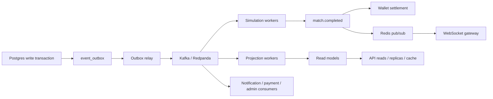
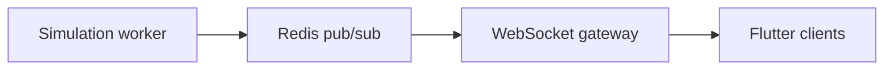

# GTEX Microservices Architecture: Render to Kubernetes

## Intent

GTEX is currently best treated as a modular monolith with explicit worker and event seams. That is the right starting point for production because it keeps deploy and debugging simple on Render while preserving a clean path to Kubernetes when traffic, queue lag, and domain ownership grow.

The target operating model is:

1. Keep HTTP APIs stateless.
2. Push cross-domain side effects through the Postgres outbox.
3. Move CPU-heavy and fan-out workloads onto broker-driven workers.
4. Split services only where ownership, scaling profile, or failure isolation justify the extra operational cost.

## Current Baseline In Repo

The current codebase already contains the backbone needed for this migration:

- API runtime: FastAPI modular monolith in `backend/app/main.py`.
- Render split: `gtex-api`, `gtex-outbox-relay`, `gtex-simulation-worker`, and `gtex-projection-workers` in `render.yaml`.
- Durable event seam: `EventOutbox` rows relayed by `OutboxRelayService` in `backend/app/backbone/outbox_relay.py`.
- Broker support: Kafka or Redpanda producer and consumer adapters in `backend/app/backbone/kafka.py`.
- Topic routing: `OutboxTopicRouter` in `backend/app/backbone/routing.py`.
- Match workers: simulation consumer entrypoint in `backend/app/backbone/simulation_worker_main.py`.
- Projection workers: standings, player stats, and match feed consumers in `backend/app/backbone/projection_worker_main.py`.
- Realtime seam: Redis-backed hybrid event fan-out in `backend/app/backbone/redis_fanout.py`.
- Payments seam: Paystack and KoraPay webhook handling in `backend/app/admin_finance/service.py`.

This means the immediate job is not a rewrite into many repos. The immediate job is to formalize boundaries, keep contracts stable, and run the existing workloads as isolated deploy units.

## Target Service Map

| Target service | Current code roots | Primary responsibility | Extraction note |
| --- | --- | --- | --- |
| API Gateway | ingress / edge plus `backend/app/api_v1` | authn at edge, routing, rate limiting, request shaping | On Kubernetes this is the ingress controller plus an external load balancer, not a custom GTEX business service. |
| Auth Service | `backend/app/auth`, `backend/app/users` | identity, token issuance, session validation | Keep in the monolith until auth traffic or compliance rules require isolation. |
| Wallet Service | `backend/app/wallets`, `backend/app/ledger`, `backend/app/treasury` | balances, ledger, deposits, withdrawals, settlement invariants | High-value domain. Extract only after contracts and ledger invariants are fully locked. |
| Match Service | `backend/app/matches`, `backend/app/match_engine`, `backend/app/competition_engine` | match lifecycle writes, scheduling, result state, orchestration | Owns write-side commands and emits lifecycle events through the outbox. |
| Simulation Workers | `backend/app/backbone/simulation_worker_main.py`, `backend/app/simulation`, `backend/app/match_engine/services` | CPU-heavy deterministic match simulation | First workload to scale independently in Kubernetes. |
| Market Service | `backend/app/market`, `backend/app/orders`, `backend/app/portfolio`, `backend/app/pricing` | listings, pricing, projections, hot summaries | Keep hot reads in Redis and replicas; extract only if market load diverges from core app traffic. |
| Club Service | `backend/app/clubs`, `backend/app/club_finance`, `backend/app/club_identity`, `backend/app/club_social` | club profile, squad, finance, fan-facing club state | Logical service boundary first, separate deploy later. |
| Payment Service | `backend/app/integrations/payments`, `backend/app/admin_finance`, `backend/app/wallets/providers` | provider quotes, order creation, webhook verification | Good candidate for earlier isolation because webhooks and provider SLAs differ from app traffic. |
| Notification Service | `backend/app/notifications`, `backend/app/realtime`, projection fan-out | inbox, websocket fan-out, push/email dispatch | Split when fan-out pressure or provider integrations require it. |
| Admin Service | `backend/app/admin`, `backend/app/admin_*`, `backend/app/observability` | control tower, finance controls, operational actions | Keep behind stricter routing, auth, and rate limits. |

## Critical Event Backbone

Canonical production backbone:

Repo-backed details:

- The outbox relay reads pending rows from `EventOutbox` and publishes them with the original event id and partition key.
- Topic routing already maps queue and wallet events to broker topics in `backend/app/backbone/routing.py`.
- Projection workers already protect themselves with idempotent receipts in `ProjectionEventReceipt`.
- Redis fan-out already exists for cross-instance event propagation through `HybridEventPublisher`.

## Match Flow

Target write flow:

1. User joins a match, tournament, or fixture-driven competition.
2. Match Service writes authoritative state to Postgres.
3. The same transaction appends an outbox row.
4. Outbox relay publishes the scheduling event to Kafka or Redpanda.
5. Simulation workers consume the event, run deterministic match execution, and emit completion events.
6. Projection workers update standings, player stats, story feed, and read models.
7. Wallet and reward handlers settle prizes and record ledger effects.

Current repo event names are slightly more concrete than the business shorthand:

- user-facing shorthand: `match.created`
- current broker topic for simulation dispatch: `gtex.match.scheduled`
- completion topics already present: `gtex.match.completed`, `gtex.match.result`, `gtex.match.replay.ready`

That distinction matters because the event contract should stay stable even if the UI language changes.

## Live Match Stream

Target live stream path:

Practical guidance:

- Use Redis pub/sub only for hot transient fan-out, not as the source of truth.
- Persist authoritative match state and replay artifacts before broadcasting final state.
- Keep websocket gateways stateless and disposable.
- Fan-out by match id, competition id, and user id to avoid broadcast storms.

Current repo status:

- Redis-backed cross-instance event propagation is already implemented.
- Realtime APIs today are wallet-centric in `backend/app/realtime`.
- Match stream channels should be added as another gateway concern, not as direct worker-to-client coupling.

## Payment Flow

Target payment path:

1. User starts deposit or purchase from the app.
2. Payment Service creates the provider order and stores the reference.
3. Paystack posts a webhook to the Payment Service.
4. Webhook signature is verified.
5. Provider event is normalized and applied to the wallet rail.
6. Wallet Service credits the balance and appends ledger entries.
7. Downstream notifications and admin views react from events, not inline branching.

Current repo mapping:

- REST order flow lives in `backend/app/integrations/payments/router.py`.
- Paystack webhook verification and event normalization live in `backend/app/admin_finance/service.py`.
- Provider adapters live under `backend/app/wallets/providers/`.
- Wallet credit and purchase-order state changes are handled through `WalletRailService` and `WalletService`.

## Scaling Rules

- APIs stay stateless. Session or connection affinity is not part of the design.
- Match simulation workers scale independently from HTTP pods.
- Projection workers scale independently from simulation workers.
- Redis is reserved for hot derived data, transient fan-out, and websocket support.
- Postgres remains the source of truth for writes, ledger state, outbox state, and durable projections.
- Read replicas serve heavy read paths such as market snapshots, standings, feeds, and replay lists.
- Worker scaling should eventually move from CPU-only HPA to queue-lag-driven autoscaling once cluster metrics are available.

## Render to Kubernetes Path

### Phase 0: Render baseline

- Keep a single API service.
- Keep dedicated Render workers for outbox relay, simulation, and projections.
- Use managed Postgres and Redis.
- Keep Kafka or Redpanda optional until queue pressure justifies it.

### Phase 1: Kubernetes for workers first

- Containerize the backend once.
- Move `outbox-relay`, `simulation-worker`, and `projection-worker` to Kubernetes.
- Keep the same database, broker, and Redis endpoints.
- Add HPA to simulation and projection workers.

This is the lowest-risk move because workers already have clear entrypoints and failure domains.

### Phase 2: API on Kubernetes

- Put the FastAPI app behind an ingress controller.
- Run at least two API replicas.
- Add readiness and liveness probes.
- Keep auth verification stateless.

### Phase 3: Read and write split

- Add read replicas for standings, feeds, wallet history, and market-heavy reads.
- Keep write traffic on the primary.
- Move long-running projections and settlement away from synchronous request paths.

### Phase 4: Real service extraction

Extract deployable services only when at least one of these becomes true:

- the scaling profile is materially different
- the data ownership boundary is stable
- the failure blast radius is too large in the shared API
- team ownership requires separate release cadence

Recommended extraction order:

1. Simulation workers and projection workers
2. Payment webhook handling
3. Notification fan-out
4. Wallet ledger boundary
5. Market and club read-heavy domains

## Operational Non-Negotiables

- Every cross-service side effect must be driven from the outbox, not from best-effort inline HTTP chains.
- Event consumers must be idempotent by event id plus projection or business key.
- Ledger writes stay authoritative in one place.
- Webhooks are verified before business processing.
- Replay, standings, and story feed projections must be rebuildable from durable state.
- Service extraction must preserve current event names or ship versioned replacements.

